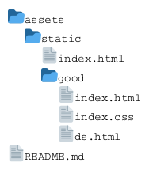
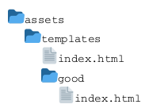

# Go Mysti 旨在提供一体化项目

## 技术栈
- Go
- Gin

## 静态资源代码结构解析

good 目录下的index.html会因为gin框架的问题，导致无法请求到
请求 `/good/index.html` 会 301 跳环到 `/good/`，请求 `/good/` 时，gin中，无法通过 http.FileSystem Open `/good/`，导致响应 404，其它均正常

## 模版资源解释

模版的名称是相对 templates 目录，在gin中使用模版时，需要填写 templates 下的相对路径